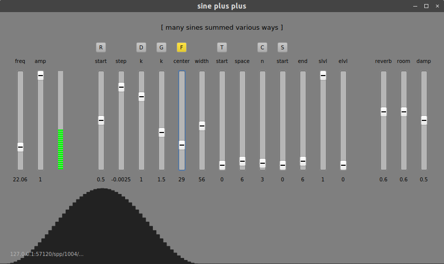

# Sine Plus Plus #

## [ many sines summed various ways ] ##

SPP is a harmonic oscillator written in SuperCollider. By default it will play
128 partials. It creates a wavetable once the amplitudes of the partials are
set to minimize the CPU load. It has a QT GUI, several modes for setting the
amplitudes array, and a built in reverb. It speaks OSC.

It looks like this :

## Launching ##

Just run the `spp.scd` file from your SuperCollider interpreter and it will
handle importing the other files.

Everything you need to customize your instance can be found in that same file.

## The modes ##

The modes are used to create arrays of amplitudes for the partials. There are
seven modes and each one has a different set of parameters. A mode is selected
by clicking on one of the buttons at the top of the controls section of the
GUI. The controls for that mode is (are) the one(s) immediately below the
mode button (and up to the next button in the case where there are multiple
controls).

### [ R ] (Ramp) ###

A linear ramp that starts at an amplitude set by `start` and moves up or down
each step by a value set by `step`.

### [ D ] (Decay) ###

Implements the formula: 1 / ((i+1) ** k) with k set by `k`.

### [ G ] (Geometric decay) ###

Implements the formula: 1 / (i ** k) with k set by `k`.

### [ F ] (Formant) ###

Formant-like structure with a `center` partial and a spread set by `width`.

### [ T ] (Teeth) ###

Partials starting on the partial set by `start` and spaced out from each other
by `space` partials.

### [ C ] (Cutoff) ###

Maximum amplitude for all partials up to the cutoff partial set by `n`.

### [ S ] (Shelf) ###

Partials from `start` to `end` ramp from an amplitude set by `slevel` (start
level) to another set by `elevel` (end level). Note that amplitudes are
normalized, so the result might not be exactly what you would expect.

### Custom amplitude arrays ###

There must be an easter-egg to do just that...

## OSC addresses ##

By default, SuperCollider will be listening on `localhost:57120`.

| Address               | Valid message
|-                      |-
| /spp/freq             | float from 10.0 to 500.0 (frequency in Hz)
| /spp/level            | float from 0.0 to 1.0
| /spp/amp              | float from 0.0 to 1.0
| /spp/verb/mix         | float from 0.0 to 1.0
| /spp/verb/room        | float from 0.0 to 1.0
| /spp/verb/damp        | float from 0.0 to 1.0
| /spp/mode             | one of ['r', 'd', 'g', 'f', 't', 'c', 's', 0]
| /spp/ramp/start       | float from 0.0 to 1.0
| /spp/ramp/step        | float from 0.0 to 1.0
| /spp/decay/k          | float from 0.0 to 1.0
| /spp/geom/k           | float from 0.0 to 1.0
| /spp/formant/center   | float from 0.0 to 1.0
| /spp/formant/width    | float from 0.0 to 1.0
| /spp/teeth/start      | float from 0.0 to 1.0
| /spp/teeth/space      | float from 0.0 to 1.0
| /spp/cutoff/n         | float from 0.0 to 1.0
| /spp/shelf/start      | float from 0.0 to 1.0
| /spp/shelf/end        | float from 0.0 to 1.0
| /spp/shelf/slevel     | float from 0.0 to 1.0
| /spp/shelf/elevel     | float from 0.0 to 1.0

## Issues ##

There are issues I'm working on. You can help if you're up for it.
You can find them [here](https://github.com/inegm/spp/issues).
